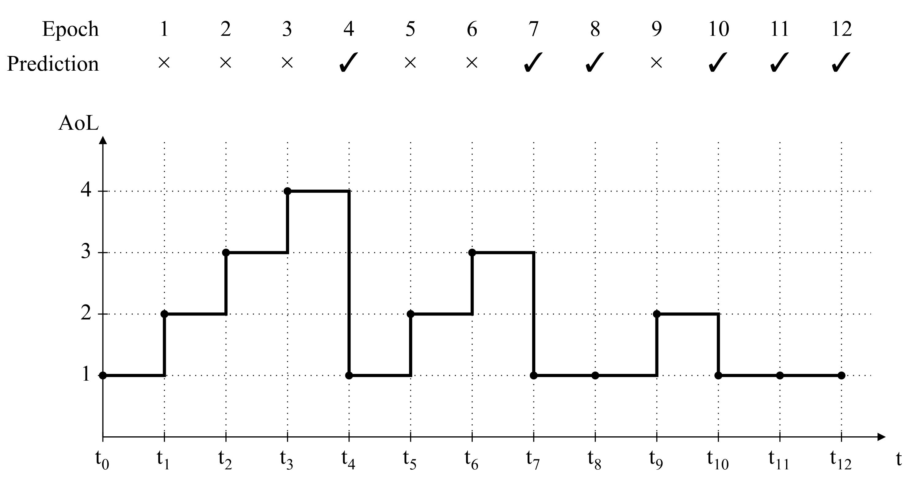
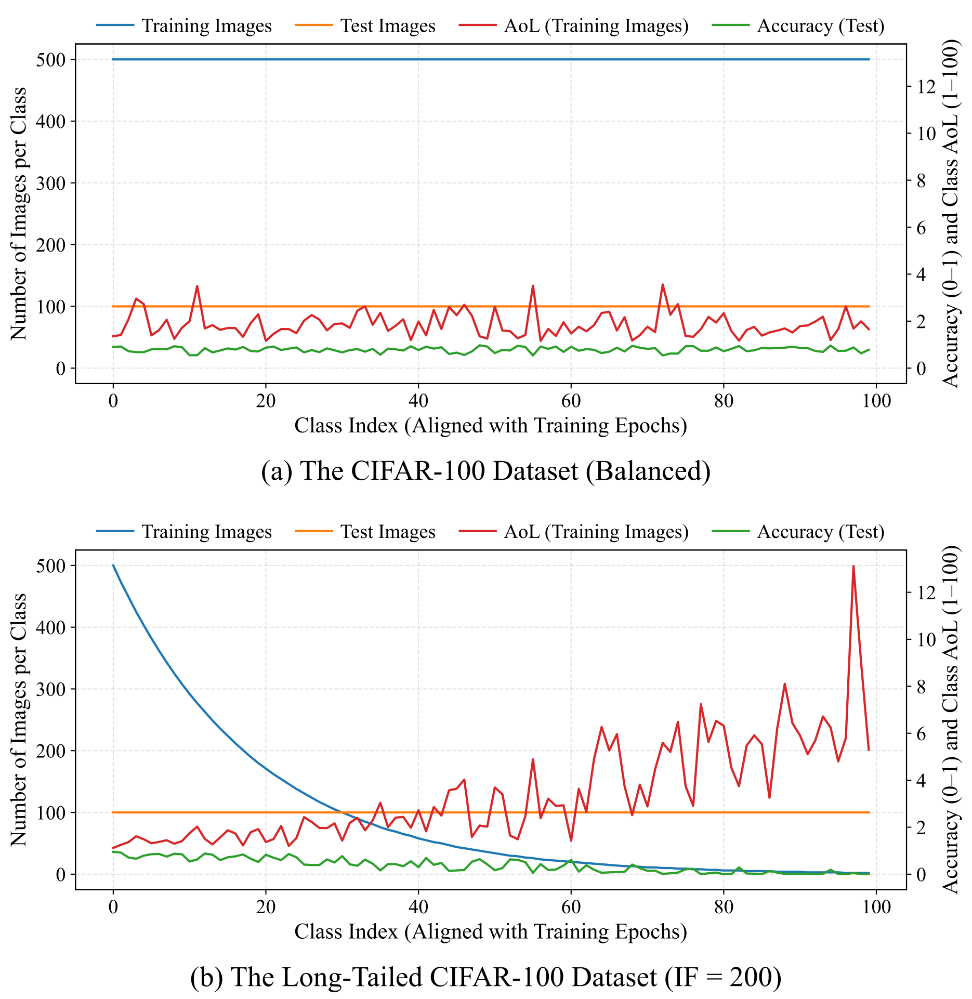
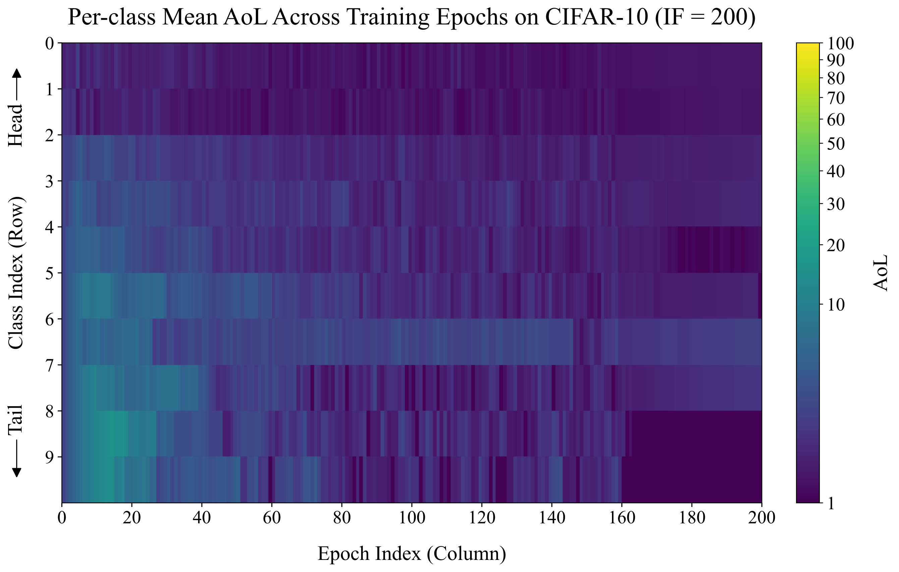
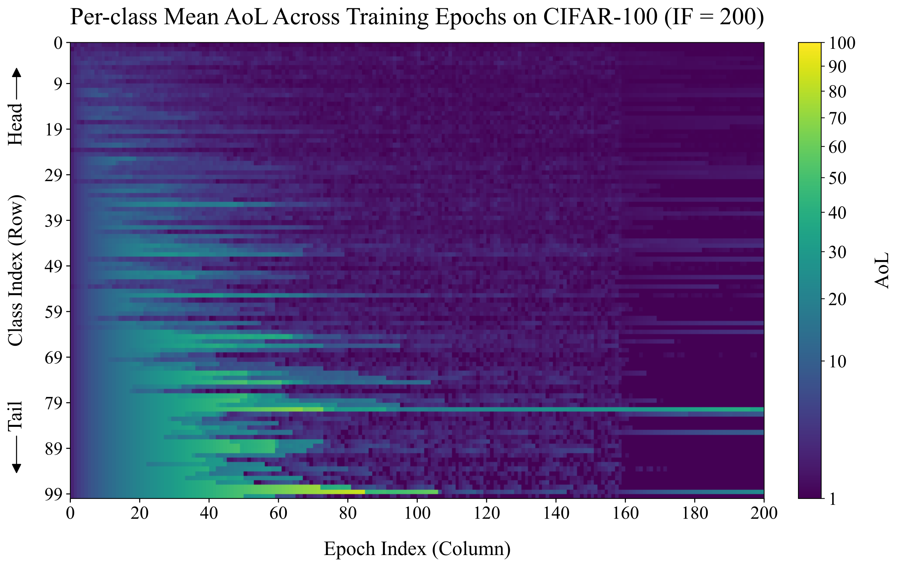

# Age of Learning: Temporal Persistence of Prediction Errors as a Learning Signal

[](https://arxiv.org/abs/2609.32593)
[](LICENSE)

**Chenyang Wang, Stefan Forsström, Roger Olsson, Di Yuan, Qing He**

Mid Sweden University · Uppsala University

**Paper:** [arXiv:2609.32593](https://arxiv.org/abs/2609.32593)  
**Code:** [github.com/sanyeungwang/Age-of-Learning](https://github.com/sanyeungwang/Age-of-Learning)

<p align="center">
  
</p>

<p align="center"><em>AoL records the duration of unresolved prediction error: it increases while an error persists and resets to one when the prediction becomes correct.</em></p>

Age of Learning (AoL) is a temporal learning-state variable that measures how long prediction errors remain unresolved. AoL increases while a sample or class remains misclassified and resets to one when the error is resolved. The paper studies AoL in both offline and streaming long-tailed classification and uses AoL to drive loss reweighting and weighted resampling.

This README documents the experiments reported in the paper and the corresponding public code paths. Auxiliary implementation options that are present in `main.py` but are not part of the reported paper experiments are intentionally not presented as reproduction targets.

## Contents

- [Method](#method)
- [Reported results](#reported-results)
- [Repository structure](#repository-structure)
- [Verified environments](#verified-environments)
- [Data preparation](#data-preparation)
- [Reproducing the CIFAR experiments](#reproducing-the-cifar-experiments)
- [Reproducing the large-scale experiments](#reproducing-the-large-scale-experiments)
- [NAISS Arrhenius / Slurm](#naiss-arrhenius--slurm)
- [Outputs](#outputs)
- [Analysis and figures](#analysis-and-figures)
- [Reproducibility notes](#reproducibility-notes)
- [Citation](#citation)
- [License](#license)
- [Contact](#contact)

## Method

### Offline AoL

For sample `i` at epoch `e`, let `c_i^(e)` denote the correctness indicator. The instantaneous AoL state is one-based:

$$
a_i^{(e)} =
\begin{cases}
1, & \text{if the prediction is correct},\\
a_i^{(e-1)} + 1, & \text{otherwise}.
\end{cases}
$$

The aggregated state is an exponential moving average:

$$
\bar a_i^{(1)} = a_i^{(1)}, \qquad
\bar a_i^{(e)} = (1-\rho)\bar a_i^{(e-1)} + \rho a_i^{(e)}.
$$

The sample-level weight is normalized to mean one. The primary class-level formulation averages aggregated sample AoL within each class and then normalizes class weights to mean one. These weights can be applied either to the loss or to weighted random resampling.

### Online AoL

In the streaming setting, the code maintains class-level states rather than persistent sample-level states for the complete history. In all reported experiments, the online AoL update is performed **once after each training epoch**, not after every SGD mini-batch. At an AoL update, the current model is evaluated on the observation set: the memory buffer when a buffer is used, otherwise the currently observed batch/subset. For each represented class, the current class accuracy is compared with the median accuracy of represented classes. The class AoL increases when its accuracy is below the median and resets to one otherwise. The class states are then aggregated with the same EMA principle and normalized before loss reweighting.

### Dynamic long-tail stream

The dynamic stream is generated from an IF=1 source pool with the exponential long-tail rule

$$
n_r = n_{\max}\mu^{-r/(C-1)}, \qquad r=0,\ldots,C-1,
$$

where `mu` is the target imbalance factor. A random permutation assigns long-tail ranks to class identities. `Period-1` refreshes this assignment every epoch; `Period-10` holds it fixed for ten consecutive epochs before resampling.

<p align="center">
  
</p>

<p align="center"><em>Class frequency, class-level AoL, and per-class test accuracy on CIFAR-100 under balanced and IF=200 settings.</em></p>

## Reported results

All values below are top-1 test accuracy (%) reported in arXiv v1.

### Offline long-tailed CIFAR

The paper reports the better of sample-level and class-level AoL for each setting; superscript `s` denotes a sample-level result.

**CIFAR-100**

| Method | IF-400 | IF-100 | IF-10 | IF-1 |
|---|---:|---:|---:|---:|
| Softmax | 31.50 | 40.10 | 57.15 | 71.59 |
| Softmax + CB | 32.04 | 40.40 | 57.48 | 71.59 |
| **Softmax + AoL** | **32.43** | **40.51** | **57.98** | **71.67** |
| Sigmoid | **33.00** | 40.65 | 57.63 | 71.33 |
| Sigmoid + CB | 32.86 | 40.81 | **58.44** | 71.33 |
| **Sigmoid + AoL** | **33.00** | **40.84** | 58.07 | **71.56** |

**CIFAR-10**

| Method | IF-400 | IF-100 | IF-10 | IF-1 |
|---|---:|---:|---:|---:|
| Softmax | 60.32 | 72.20 | 86.72 | 92.98 |
| Softmax + CB | 61.31 | 73.59 | 86.74 | 92.98 |
| **Softmax + AoL** | **63.94<sup>s</sup>** | **73.74<sup>s</sup>** | **86.80** | **93.19** |
| Sigmoid | 60.17 | 71.85 | 86.88 | 93.00 |
| Sigmoid + CB | 64.45 | **74.96** | **87.28** | 93.00 |
| **Sigmoid + AoL** | **66.62** | 72.76 | 87.27 | **93.39** |

### Period-10 online results over three seeds

The paper evaluates seeds `42`, `1024`, and `2026`.

**CIFAR-10**

| IF | Seed | Softmax | Softmax + AoL | Gain |
|---:|---:|---:|---:|---:|
| 200 | 42 | 77.85 | **81.44** | +3.59 |
| 200 | 1024 | 76.52 | **79.10** | +2.58 |
| 200 | 2026 | 75.69 | **78.83** | +3.14 |
| 200 | Mean | 76.69 ± 1.09 | **79.79 ± 1.44** | +3.10 ± 0.51 |
| 50 | 42 | 82.67 | **85.36** | +2.69 |
| 50 | 1024 | 84.11 | **84.55** | +0.44 |
| 50 | 2026 | 83.29 | **84.42** | +1.13 |
| 50 | Mean | 83.36 ± 0.72 | **84.78 ± 0.51** | +1.42 ± 1.15 |
| 10 | 42 | 86.93 | **87.58** | +0.65 |
| 10 | 1024 | 86.22 | **87.25** | +1.03 |
| 10 | 2026 | 86.42 | **87.51** | +1.09 |
| 10 | Mean | 86.52 ± 0.37 | **87.45 ± 0.17** | +0.92 ± 0.24 |

**CIFAR-100**

| IF | Seed | Softmax | Softmax + AoL | Gain |
|---:|---:|---:|---:|---:|
| 200 | 42 | 42.78 | **44.18** | +1.40 |
| 200 | 1024 | 42.61 | **45.79** | +3.18 |
| 200 | 2026 | 42.97 | **45.31** | +2.34 |
| 200 | Mean | 42.79 ± 0.18 | **45.09 ± 0.83** | +2.31 ± 0.89 |
| 50 | 42 | 49.61 | **50.65** | +1.04 |
| 50 | 1024 | 48.73 | **51.19** | +2.46 |
| 50 | 2026 | 49.95 | **50.72** | +0.77 |
| 50 | Mean | 49.43 ± 0.63 | **50.85 ± 0.29** | +1.42 ± 0.91 |
| 10 | 42 | **57.31** | **57.31** | 0.00 |
| 10 | 1024 | **56.75** | **56.75** | 0.00 |
| 10 | 2026 | 56.63 | **56.69** | +0.06 |
| 10 | Mean | 56.90 ± 0.36 | **56.92 ± 0.34** | +0.02 ± 0.03 |

### Large-scale Period-10 evaluation

The paper uses the full training sets of Places365-Standard and ImageNet-1K as source pools, training at `224 x 224` with ResNet-34, seed `42`, learning rate `0.01`, and a fixed memory buffer of `500,000` observations.

| Dataset | IF | Softmax | Softmax + AoL | Gain |
|---|---:|---:|---:|---:|
| Places365 | 200 | 37.23 | **39.79** | +2.56 |
| Places365 | 50 | 42.31 | **43.79** | +1.48 |
| Places365 | 10 | 46.95 | **47.24** | +0.29 |
| ImageNet-1K | 200 | 46.74 | **48.31** | +1.57 |
| ImageNet-1K | 50 | 54.46 | **54.81** | +0.35 |
| ImageNet-1K | 10 | **61.30** | **61.30** | 0.00 |

The paper states that the large-scale study was run on four NVIDIA GH200 Grace Hopper Superchips. Operationally, each independent dataset/IF/rho/seed training run in this repository uses **one GPU**; independent runs can be scheduled concurrently. This repository does not use multi-GPU DDP for these experiments.

## Repository structure

Clone the repository and run all commands below from its root unless stated otherwise:

```bash
git clone https://github.com/sanyeungwang/Age-of-Learning.git
cd Age-of-Learning
```

```text
Age-of-Learning/
├── README.md
├── LICENSE
├── main.py
├── prepare_imagenet_full_lmdb.py
├── prepare_places365_full_lmdb.py
├── prepare_insight.py
├── calculate_pearson.py
├── draw_AoL.py
├── draw_insight.py
├── draw_heatmap_cifar10.py
├── draw_heatmap_cifar100.py
└── figures/
    ├── AoL.png
    ├── insight.png
    ├── heatmap_cifar10.png
    └── heatmap_cifar100.png
```

`main.py` contains the reported offline and online AoL training logic. The two `prepare_*_lmdb.py` scripts convert the full large-scale datasets into the LMDB format consumed by `main.py`. The remaining scripts support the motivating analysis, Pearson correlations, and paper figures.

## Verified environments

The tables below record environments that were actually used and subsequently verified. The original environment-creation commands were not archived, so this README does not invent Conda/pip installation commands. Use these versions as the reproducibility reference; compatible environments may also work.

### CIFAR training and analysis server

CIFAR model training in the paper used a single NVIDIA TITAN X (Pascal). Pearson calculation and plotting are ordinary Python analysis steps and do not require a GPU.

| Component | Verified version |
|---|---|
| Architecture | x86_64 |
| Python | 3.12.9 |
| PyTorch | 2.7.0+cu118 |
| torchvision | 0.22.0+cu118 |
| PyTorch CUDA build | 11.8 |
| cuDNN | 9.1 |
| NumPy | 2.1.2 |
| pandas | 3.0.2 |
| SciPy | 1.17.1 |
| Matplotlib | 3.10.6 |
| Pillow | 12.0.0 |
| Training GPU | NVIDIA TITAN X (Pascal), 12 GB |

A typical single-GPU invocation is:

```bash
CUDA_VISIBLE_DEVICES=<TITAN_X_GPU_ID> python main.py ...
```

### Large-scale Arrhenius training environment

| Component | Verified version |
|---|---|
| Compute-node architecture | aarch64 |
| Python | 3.13.5 |
| PyTorch | 2.13.0+cu130 |
| torchvision | 0.28.0+cu130 |
| PyTorch CUDA build | 13.0 |
| cuDNN | 9.20 |
| NumPy | 2.5.2 |
| LMDB | 2.3.0 |
| Pillow | 12.3.0 |
| PyArrow | 25.0.1 |
| Training GPU | NVIDIA GH200 120GB |

On Arrhenius, the GH200 Python environment is an aarch64 environment and should be activated **inside an allocated compute job**, not on an x86 login node.

### ImageNet download environment

The ImageNet Hugging Face download was performed separately with:

| Component | Verified version |
|---|---|
| Python | 3.9.25 |
| `huggingface_hub` | 1.8.0 |

This download environment is not the large-scale training environment.

### Dependency map

| Task | Required Python packages beyond the standard library |
|---|---|
| CIFAR training | `torch`, `torchvision`, `numpy`, `lmdb`, `Pillow` |
| ImageNet/Places365 training | `torch`, `torchvision`, `numpy`, `lmdb`, `Pillow` |
| ImageNet LMDB conversion | `numpy`, `lmdb`, `Pillow`, `pyarrow` |
| Places365 LMDB conversion | `numpy`, `lmdb`, `Pillow` |
| Pearson analysis | `pandas`, `scipy` |
| Figure generation | `numpy`, `pandas` where applicable, `matplotlib` |
| Hugging Face download | `huggingface_hub` |

## Data preparation

### CIFAR-10 and CIFAR-100

No manual download is required. `main.py` uses `torchvision.datasets.CIFAR10` / `CIFAR100` with `download=True` and stores the datasets under `./data`.

Offline long-tailed CIFAR sets are constructed with the exponential rule using `--imb_factor`. For `online_dynamic_lt`, `main.py` automatically uses an IF=1 source pool and constructs a new long-tailed subset at each epoch according to the target `--imb_factor` and `--lt_shuffle_period`.

### ImageNet-1K

The released converter expects the Hugging Face `ILSVRC/imagenet-1k` parquet layout. Access to this dataset is gated by the ImageNet terms on Hugging Face.

Authenticate and download the dataset:

```bash
hf auth login

hf download ILSVRC/imagenet-1k \
  --repo-type dataset \
  --local-dir /path/to/imagenet_hf
```

The converter expects:

```text
/path/to/imagenet_hf/
└── data/
    ├── train-*.parquet       # 294 shards
    └── validation-*.parquet  # 14 shards
```

Convert the parquet shards to LMDB:

```bash
python prepare_imagenet_full_lmdb.py \
  --input_root /path/to/imagenet_hf \
  --output_root /path/to/imagenet_full \
  --workers 16
```

Expected output:

```text
/path/to/imagenet_full/
├── train.lmdb/
├── val.lmdb/
├── train_targets.npy
├── val_targets.npy
└── metadata.json
```

The ImageNet converter verifies that each source image is decodable but stores the original compressed image bytes. The `224 x 224` training input is produced by the runtime transforms in `main.py` (`RandomResizedCrop(224)` for training and `Resize(256) + CenterCrop(224)` for evaluation).

`hf-download` was used only for the Hugging Face download. The converter itself requires `pyarrow`, `lmdb`, `Pillow`, and `numpy`; on Arrhenius these dependencies were available in the verified GH200 training environment.

### Places365-Standard

Use the official **high-resolution Places365-Standard** train and validation archives and the official train/validation file lists. Source references: [Places365 download page](https://places2.csail.mit.edu/download-private.html) and [Places365 development kit](https://github.com/zhoubolei/places_devkit).

The high-resolution image archives used in the experiments can be downloaded without extraction:

```bash
wget -c https://data.csail.mit.edu/places/places365/train_large_places365standard.tar
wget -c https://data.csail.mit.edu/places/places365/val_large.tar
```

Obtain `places365_train_standard.txt` and `places365_val.txt` from the official Places365 metadata/devkit. The converter expects this exact layout:

```text
/path/to/places365_archives/
├── train_large_places365standard.tar
├── val_large.tar
├── places365_train_standard.txt
└── places365_val.txt
```

Official high-resolution archive checksums:

```text
67e186b496a84c929568076ed01a8aa1  train_large_places365standard.tar
9b71c4993ad89d2d8bcbdc4aef38042f  val_large.tar
```

The converter streams the tar archives directly; **do not extract the full image archives before conversion**. This avoids creating roughly 1.84 million individual image files before LMDB construction.

Convert to the format used by the paper experiments:

```bash
python prepare_places365_full_lmdb.py \
  --archive_root /path/to/places365_archives \
  --output_root /path/to/places365_full \
  --image_size 224 \
  --jpeg_quality 90 \
  --workers 16
```

Expected output:

```text
/path/to/places365_full/
├── train.lmdb/
├── val.lmdb/
├── train_targets.npy
├── val_targets.npy
└── metadata.json
```

The converter checks the expected full Places365-Standard sizes (`1,803,460` train, `36,500` validation, `365` classes), resizes images to `224 x 224` with bilinear interpolation, re-encodes them as JPEG at quality `90`, writes the labels and image bytes to LMDB, and verifies the generated databases.

The Places365 converter requires `lmdb`, `Pillow`, and `numpy`; these were available in the verified GH200 environment used for the large-scale workflow.

## Reproducing the CIFAR experiments

The paper uses ResNet-32 for the main offline and streaming CIFAR experiments.

### Offline protocol

Paper settings:

```text
model          ResNet-32
optimizer      SGD
momentum       0.9
weight decay   2e-4
batch size     128
epochs         200
initial LR     0.1
warmup         5 epochs
LR decay       x0.01 at epoch 160, x0.0001 of base LR at epoch 180
augmentation   random crop + horizontal flip
AoL evaluation unaugmented training-evaluation set
```

A Softmax baseline run is:

```bash
CUDA_VISIBLE_DEVICES=<TITAN_X_GPU_ID> python main.py \
  --dataset cifar100 \
  --model resnet32 \
  --setting offline \
  --imb_factor 200 \
  --loss_type softmax \
  --weight_scope class \
  --loss_weight_type none \
  --sampler_weight_type none \
  --seed 42
```

Class-level Softmax + AoL loss reweighting is:

```bash
CUDA_VISIBLE_DEVICES=<TITAN_X_GPU_ID> python main.py \
  --dataset cifar100 \
  --model resnet32 \
  --setting offline \
  --imb_factor 200 \
  --loss_type softmax \
  --weight_scope class \
  --loss_weight_type age \
  --sampler_weight_type none \
  --age_fuse ema \
  --age_rho <RHO> \
  --seed 42
```

For sample-level AoL, change only:

```bash
--weight_scope sample
```

For the Sigmoid experiments, change only:

```bash
--loss_type sigmoid
```

For CB loss reweighting, use:

```bash
--loss_weight_type cb --cb_beta <BETA>
```

The paper searches:

```text
rho  in {0.0, 0.1, ..., 1.0}
beta in {0.9, 0.99, 0.999, 0.9999}
```

The paper uses validation to select `rho` / `beta`, and reserves test data for final reporting.

### AoL weighted resampling

To evaluate AoL as a sampler rather than as a loss weight:

```bash
CUDA_VISIBLE_DEVICES=<TITAN_X_GPU_ID> python main.py \
  --dataset cifar100 \
  --model resnet32 \
  --setting offline \
  --imb_factor 200 \
  --loss_type softmax \
  --weight_scope class \
  --loss_weight_type none \
  --sampler_weight_type age \
  --age_fuse ema \
  --age_rho <RHO> \
  --seed 42
```

For CB weighted resampling, use `--sampler_weight_type cb --cb_beta <BETA>`.

### Offline arrival-imbalance ablation

Appendix B.2 keeps CIFAR class frequencies balanced (`IF=1`) but retains only a fraction

```text
p in {1, 2, 5, 10, 20, 50, 100}%
```

of training samples at the beginning of each epoch. In `main.py`, the equivalent setting is

```text
--epoch_drop_percent = 100 - p
```

For example, the 5% arrival condition is:

```bash
CUDA_VISIBLE_DEVICES=<TITAN_X_GPU_ID> python main.py \
  --dataset cifar100 \
  --model resnet32 \
  --setting offline \
  --imb_factor 1 \
  --epoch_drop_percent 95 \
  --loss_type softmax \
  --weight_scope class \
  --loss_weight_type age \
  --sampler_weight_type none \
  --age_fuse ema \
  --age_rho <RHO> \
  --seed 42
```

Use `--loss_weight_type none` for the corresponding baseline and `--loss_type sigmoid` for the Sigmoid rows. The paper applies loss reweighting only in this ablation. Samples that have never been observed remain excluded from AoL aggregation; previously observed samples that are absent from the current epoch continue to age according to the arrival-imbalance rule described in Appendix B.2.

### Online stream with 5% accessibility

The access-constrained experiment exposes only 5% of the long-tailed training samples at each epoch. In the code, this is represented by dropping 95% of samples at the beginning of each epoch:

```bash
CUDA_VISIBLE_DEVICES=<TITAN_X_GPU_ID> python main.py \
  --dataset cifar10 \
  --model resnet32 \
  --setting online \
  --imb_factor 200 \
  --batch 128 \
  --epochs 200 \
  --lr 0.1 \
  --epoch_drop_percent 95 \
  --buffer_mode fixed \
  --buffer_size 10000 \
  --loss_type softmax \
  --weight_scope class \
  --loss_weight_type age \
  --sampler_weight_type none \
  --age_fuse ema \
  --age_rho <RHO> \
  --seed 42
```

For the paper's large-buffer variant, use `--buffer_mode infinite`. For the Softmax baseline, use `--loss_weight_type none` while keeping the stream construction unchanged.

### Dynamic long-tail: Period-1 and Period-10

The paper's dynamic CIFAR stream uses a fixed reservoir buffer of `50,000` and Softmax loss reweighting.

Period-1:

```bash
CUDA_VISIBLE_DEVICES=<TITAN_X_GPU_ID> python main.py \
  --dataset cifar10 \
  --model resnet32 \
  --setting online_dynamic_lt \
  --imb_factor 200 \
  --batch 128 \
  --epochs 200 \
  --lr 0.1 \
  --buffer_mode fixed \
  --buffer_size 50000 \
  --lt_shuffle_period 1 \
  --loss_type softmax \
  --weight_scope class \
  --loss_weight_type age \
  --sampler_weight_type none \
  --age_fuse ema \
  --age_rho <RHO> \
  --seed 42
```

Period-10 is identical except for:

```bash
--lt_shuffle_period 10
```

To reproduce the paper's three-seed Period-10 study, use seeds `42`, `1024`, and `2026`, IFs `200`, `50`, and `10`, and sweep `rho` over the predefined grid:

```bash
for seed in 42 1024 2026; do
  for IF in 200 50 10; do
    for rho in 0.0 0.1 0.2 0.3 0.4 0.5 0.6 0.7 0.8 0.9 1.0; do
      CUDA_VISIBLE_DEVICES=<TITAN_X_GPU_ID> python main.py \
        --dataset cifar10 \
        --model resnet32 \
        --setting online_dynamic_lt \
        --imb_factor "$IF" \
        --batch 128 \
        --epochs 200 \
        --lr 0.1 \
        --buffer_mode fixed \
        --buffer_size 50000 \
        --lt_shuffle_period 10 \
        --loss_type softmax \
        --weight_scope class \
        --loss_weight_type age \
        --sampler_weight_type none \
        --age_fuse ema \
        --age_rho "$rho" \
        --seed "$seed"
    done
  done
done
```

Repeat with `--dataset cifar100` for CIFAR-100. Run the corresponding Softmax baselines with `--loss_weight_type none`.

## Reproducing the large-scale experiments

The large-scale paper protocol is:

```text
datasets        full Places365-Standard / full ImageNet-1K
input size      224 x 224
model           ResNet-34, trained from scratch
setting         online_dynamic_lt
period          10
IF              200 / 50 / 10
seed            42
buffer          fixed reservoir, 500,000
loss            Softmax
AoL scope       class
AoL application loss reweighting
batch size      256
eval batch      256
epochs          200
learning rate   0.01, fixed in the online setting
momentum        0.9
weight decay    1e-4
workers         16
GPU per run     1 x NVIDIA GH200
```

A direct Places365 AoL run is:

```bash
python main.py \
  --dataset places365 \
  --data_root /path/to/places365_full \
  --model resnet34 \
  --setting online_dynamic_lt \
  --imb_factor 200 \
  --buffer_mode fixed \
  --buffer_size 500000 \
  --lt_shuffle_period 10 \
  --loss_type softmax \
  --weight_scope class \
  --loss_weight_type age \
  --sampler_weight_type none \
  --age_fuse ema \
  --age_rho <RHO> \
  --batch 256 \
  --eval_batch 256 \
  --epochs 200 \
  --lr 0.01 \
  --momentum 0.9 \
  --weight_decay 0.0001 \
  --workers 16 \
  --seed 42
```

For ImageNet-1K, change only the dataset and data root:

```bash
--dataset imagenet --data_root /path/to/imagenet_full
```

For the Softmax baseline, use:

```bash
--loss_weight_type none
```

The large-scale paper results use seed `42`. AoL uses the same predefined `rho` grid as the rest of the paper; select the reported setting through the paper's validation protocol rather than by test accuracy.

## NAISS Arrhenius / Slurm

The following template mirrors the resource shape and software stack used for the large-scale experiments while deliberately omitting private project/account paths. Replace all angle-bracket placeholders before submitting.

### Interactive environment check

Do not activate the aarch64 GH200 environment on an x86 login node. Allocate a GH200 compute node first:

```bash
srun \
  -A <NAISS_PROJECT> \
  -p gpu \
  --gpus=1 \
  -N 1 \
  -c 4 \
  --mem=16G \
  -t 00:30:00 \
  --pty bash -l
```

Inside the allocated compute shell:

```bash
module purge
module load GPU/Python/3.13.5-bare-gcc-2025b-eb
source <AOL_GH200_ENV>/bin/activate

hostname
uname -m
python --version
nvidia-smi
```

The expected compute architecture is `aarch64` and the training GPU is an NVIDIA GH200.

### Single-run Slurm template

```bash
#!/bin/bash
#SBATCH -A <NAISS_PROJECT>
#SBATCH -p gpu
#SBATCH --gpus=1
#SBATCH -n 1
#SBATCH -c 16
#SBATCH --mem=64G
#SBATCH -t <WALLTIME>
#SBATCH -o <SLURM_LOG_DIR>/%x_%j.out
#SBATCH -e <SLURM_LOG_DIR>/%x_%j.err

set -euo pipefail

# Edit these four fields for the target experiment.
DATASET=places365
DATA=/path/to/places365_full
IF=200
SEED=42

# Arguments: MODE is "none" for the Softmax baseline or "age" for AoL.
MODE="$1"
RHO="$2"

module purge
module load GPU/Python/3.13.5-bare-gcc-2025b-eb
source <AOL_GH200_ENV>/bin/activate

cd /path/to/Age-of-Learning

python --version
nvidia-smi --query-gpu=name,memory.total --format=csv,noheader

srun python main.py \
  --dataset "$DATASET" \
  --data_root "$DATA" \
  --model resnet34 \
  --setting online_dynamic_lt \
  --imb_factor "$IF" \
  --buffer_mode fixed \
  --buffer_size 500000 \
  --lt_shuffle_period 10 \
  --loss_type softmax \
  --weight_scope class \
  --loss_weight_type "$MODE" \
  --sampler_weight_type none \
  --age_fuse ema \
  --age_rho "$RHO" \
  --batch 256 \
  --eval_batch 256 \
  --epochs 200 \
  --lr 0.01 \
  --momentum 0.9 \
  --weight_decay 0.0001 \
  --workers 16 \
  --seed "$SEED"
```

Submit the baseline once:

```bash
sbatch -J p365_if200_s42_softmax run_large_scale.sbatch none 0.0
```

Submit the AoL rho sweep as independent single-GPU runs:

```bash
for rho in 0.0 0.1 0.2 0.3 0.4 0.5 0.6 0.7 0.8 0.9 1.0; do
  tag=${rho/./p}
  sbatch \
    -J "p365_if200_s42_r${tag}" \
    run_large_scale.sbatch age "$rho"
done
```

For ImageNet-1K, set `DATASET=imagenet` and point `DATA` to the prepared ImageNet LMDB root. For IF-50 and IF-10, change only `IF`. Walltime is a scheduler/resource choice and is intentionally not treated as a paper hyperparameter.

### Monitor jobs

```bash
squeue -u "$USER" \
  -o "%.12i %.55j %.10T %.10M %.12l %.8N %.35R"

squeue --start -u "$USER" \
  -o "%.12i %.55j %.10T %.20S %.12R"
```

After completion, use Slurm accounting rather than only the live queue:

```bash
sacct -X -j <JOBID_OR_JOBID_LIST> \
  --format=JobID,JobName%55,State,ExitCode,Elapsed,NodeList
```

A successful run should end in `COMPLETED` with exit code `0:0`.

## Outputs

`main.py` creates the following outputs relative to the working directory:

```text
logs/
└── <run_name>.log

weights/
├── <run_name>_best.pth
└── <run_name>_last.pth

per_class_stats/
└── <run_name>_per_class_age_acc_counts.csv
```

The per-class CSV contains:

```text
class_idx
avg_age
avg_age_test
per_class_acc_best
per_class_acc_last
per_class_avg_margin_last
per_class_avg_loss_last
train_class_count
test_class_count
```

The run name records the dataset, model, IF, setting, loss, weighting scope, loss/sampler weighting types, rho, seed, Period-K value, and epoch count.

## Analysis and figures

### Pearson correlation

`calculate_pearson.py` is a CPU analysis script; it does not require a GPU. It was run in the same verified Python environment used on the CIFAR server. Set its two `file_name.csv` placeholders to the per-class CSVs for the IF=1 and IF=200 diagnostic runs, then execute:

```bash
python calculate_pearson.py
```

The paper reports the following Pearson correlations between class-level AoL and class-level loss/margin:

| IF | Train loss | Train margin | Test loss | Test margin |
|---:|---:|---:|---:|---:|
| 1 | 0.7841 | -0.7757 | 0.6352 | -0.6882 |
| 200 | 0.6697 | -0.6633 | 0.4300 | -0.3883 |

### AoL illustration

`draw_AoL.py` is self-contained apart from its optional Times New Roman font path. It writes both PDF and PNG outputs:

```bash
python draw_AoL.py
```

### Motivating observation

`prepare_insight.py` generates CIFAR-100 diagnostic statistics for the motivating observation. The script uses ResNet-34 for 100 epochs, matching the setup described in the paper's motivating experiment. In the released script, `CUDA_VISIBLE_DEVICES` is set internally to `1`; on the original server that physical device is an NVIDIA TITAN X (Pascal). If your TITAN X has a different device index, edit that single device-selection line before running.

```bash
python prepare_insight.py --imb_factor 1 --seed 42
python prepare_insight.py --imb_factor 200 --seed 42
```

`draw_insight.py` contains a `file_name.csv` placeholder. Point it to the desired generated per-class statistics CSV before running:

```bash
python draw_insight.py
```

### AoL heatmaps

The publication heatmaps are included at:

```text
figures/heatmap_cifar10.png
figures/heatmap_cifar100.png
```

<p align="center">
  
  
</p>

`draw_heatmap_cifar10.py` and `draw_heatmap_cifar100.py` expect a CSV containing `class_idx` and `epochNNN` columns and currently contain placeholder `csv_path` / `out_dir` values. Set those paths before executing the scripts. The final processed CSV inputs used for the publication heatmaps are not included in this repository.

The visualization scripts also contain an optional `path/times.ttf` placeholder. Use a locally available Times New Roman font if exact typography is required; otherwise Matplotlib will use its available font configuration.

## Reproducibility notes

### Hyperparameter selection

The paper follows the validation protocol of the original Class-Balanced Loss study: `beta` is searched over `{0.9, 0.99, 0.999, 0.9999}` and AoL `rho` over `{0.0, 0.1, ..., 1.0}`. Test data are reserved for final accuracy reporting.

The current public `main.py` also saves `weights/<run_name>_best.pth` whenever test accuracy improves. This checkpoint is a logging/convenience artifact of the implementation and should **not** be used to select `rho` or `beta` when reproducing the paper's validation protocol.

### Randomness

`main.py` enables deterministic PyTorch algorithms, sets the PyTorch seed from `--seed`, seeds CUDA, seeds the DataLoader generator, and seeds NumPy/Python inside DataLoader workers. The dynamic long-tail construction uses a NumPy generator initialized from `seed + epoch`.

The fixed-buffer reservoir replacement in the current release uses the process-global NumPy RNG (`np.random.randint`) without an explicit main-process `np.random.seed(args.seed)`. Consequently, the exact reservoir replacement trajectory is not guaranteed to be identical across repeated executions with the same `--seed`. This README documents the released implementation as-is; no reservoir behavior has been changed.

### Scope of the large-scale results

The Places365 and ImageNet-1K experiments are controlled Period-10 evaluations on full source pools. They are intended to test scale transfer of the AoL mechanism, not to establish a state-of-the-art ranking on naturally long-tailed large-scale benchmarks.

## Citation

If you found this code or our work useful, please cite the preprint:

```bibtex
@misc{wang2026agelearningtemporalpersistence,
      title={Age of Learning: Temporal Persistence of Prediction Errors as a Learning Signal}, 
      author={Chenyang Wang and Stefan Forsström and Roger Olsson and Di Yuan and Qing He},
      year={2026},
      eprint={2609.32593},
      archivePrefix={arXiv},
      primaryClass={cs.LG},
      url={https://arxiv.org/abs/2609.32593}, 
}
```

## License

This repository is released under the [MIT License](LICENSE).

## Contact

For questions about the code or paper, please open a GitHub issue or contact us.
